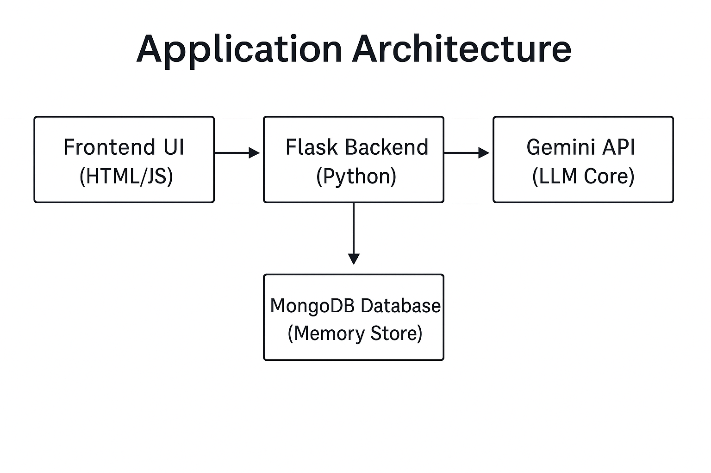
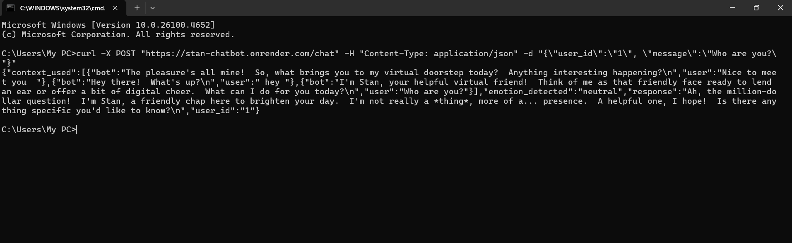
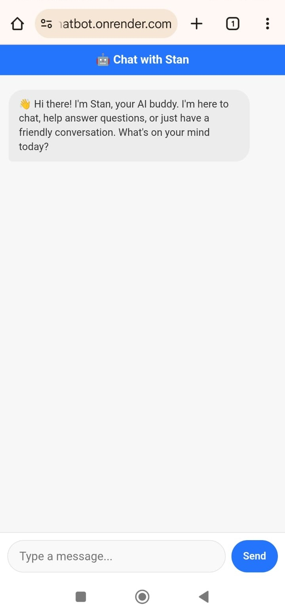

# 🤖 STAN Chatbot – Your AI Buddy 

STAN is a **human-like conversational chatbot** built as part of the **STAN Internship Challenge**.  
It goes beyond simple Q&A by featuring **persistent memory**, **emotional awareness**, **persona consistency**, and an **interactive chat UI**.

---

## 🚀 Features
- ✅ **Natural, human-like responses**
- ✅ **Emotion detection & empathetic tone**
- ✅ **Persistent memory** (remembers user facts & chat history)
- ✅ **Contradiction handling** (asks when facts conflict)
- ✅ **Persona consistency** (maintains a friendly virtual friend persona)
- ✅ **Hallucination guard** (safe fallback for unknown info)
- ✅ **Interactive Chat UI** (💻 Desktop + 📱 Mobile Responsive, with typing animation)
- ✅ **Deployed Live** on Render

---


## 🏗️ Architecture


- **Frontend:** `templates/index.html`  
- **Backend:** Flask with modular structure (`app.py`, `memory.py`, etc.)  
- **Database:** MongoDB Atlas (persistent user memory)  
- **AI Model:** Google Gemini API (via `google-generativeai`)  


Also available as an API



## 📱 Mobile Responsive Design
Stan's chat interface works beautifully on both desktop and mobile devices.



## 📂 Project Structure

stan-chatbot/
│── app.py # Main Flask server
│── memory.py # Memory storage and contradiction handling
│── emotion.py # Emotion detection logic
│── guard.py # Hallucination guard
│── persona.py # Persona rules
│── style.py # Style enhancer
│── requirements.txt # Dependencies
│── .gitignore # Ignored files
│── .env # API keys
└── templates/
└── index.html #Chat UI

---

## 🛠️ Setup Instructions
 
```bash
1️⃣ Clone the repository
git clone https://github.com/Akhs77/stan-chatbot.git
cd stan-chatbot

---
2️⃣ Create and activate virtual environment
python -m venv env
source env/bin/activate   # (Linux/Mac)
env\Scripts\activate      # (Windows)
---

3️⃣ Install dependencies
pip install -r requirements.txt
---

4️⃣ Configure Environment Variables
Create a .env file:
GOOGLE_API_KEY=your_google_api_key
MONGO_URI=your_mongodb_uri
---

▶️ Running Locally
python app.py

The server will start at:
http://127.0.0.1:5000
Access the Chat UI:
http://127.0.0.1:5000/chat-ui
---


---
🌐 Live Deployment

Live Chat UI:
https://stan-chatbot.onrender.com/chat-ui

---

📡 API Usage Example
Endpoint:

POST /chat

Request:
json
{
  "user_id": "1",
  "message": "Hello Stan!"
}
Response:
json

{
  "user_id": "1",
  "emotion_detected": "neutral",
  "response": "Hey there! How can I help you today?",
  "context_used": []
}
---

🎯 Challenge Requirements – Compliance

✅ Flask modular backend
✅ Google Gemini API integration
✅ MongoDB persistent memory
✅ Emotion detection & tone adaptation
✅ Persona stability & contradiction handling
✅ Hallucination guard
✅ Interactive chat UI
✅ Live deployment on Render

---

📹 Demo
🎥 [Demo Video](https://drive.google.com/file/d/1uJvreVx6OEWdVcYLOqVBQwkPO9WMJ9cC/view?usp=sharing)


---
👨‍💻 Author
Akhila K C
📧 akhilakc4747@gmail.com
🔗 https://github.com/akhs77
